# wifi-alarm

WiFi CSI-based presence sensing with a Telegram + email + siren alarm flow.
Runs on a Raspberry Pi 3B+ over Ethernet with Nexmon CSI on the onboard
Broadcom WiFi. Develops cross-platform in a container with synthetic CSI.

## Architecture

Hexagonal / ports-and-adapters. The domain layer is pure, no IO, no third-party
deps; adapters live behind abstract interfaces and are wired by a composition
root according to a profile (`dev` or `pi`).



See [`docs/architecture.md`](docs/architecture.md) for detailed diagrams of the
hexagonal layout, the three concurrent runtime loops, and the state machine.
Diagram sources live in `docs/diagrams/*.mmd`; re-render with `./scripts/render-diagrams.sh`.

```
domain/      pure state machine + detector
ports/       abstract interfaces (Clock, CsiSource, Notifier, Siren, Store)
adapters/    concrete implementations
  csi/       synthetic | nexmon (Pi onboard WiFi)
  notifier/  console | telegram | email | composite (fan-out)
  siren/     mock | gpio (relay)
  clock/     system | fake (manual time advancement)
  store/     memory | sqlite
app/         config, composition root, async runtime, main entry
```

The runtime has three concurrent loops:

- **capture_loop** — pulls CSI frames, runs the variance detector, hands
  motion events to the state machine.
- **inbound_loop** — reads Telegram replies / commands, hands them to the
  state machine.
- **tick_loop** — drives the state machine clock once per second so reply
  timeouts and snooze expiry fire on time.

The state machine is a pure transition function. It emits side-effects
(`NotifyOwner`, `SirenOn`, `SirenOff`, `LogEvent`) that the runtime dispatches
to adapters. Nothing in `domain/` knows about Telegram, GPIO, or SQLite.

## State machine

```
DISARMED ── /arm ──▶ ARMED
ARMED    ── motion ──▶ ALERTING  (notify owner with Dismiss/Confirm buttons)
ALERTING ── dismiss reply ──▶ ARMED
ALERTING ── confirm reply ──▶ TRIGGERED (siren on)
ALERTING ── timeout (no reply within REPLY_TIMEOUT_S) ──▶ TRIGGERED
TRIGGERED ── /disarm ──▶ DISARMED (siren off)
*         ── /panic ──▶ TRIGGERED
*         ── /snooze N ──▶ DISARMED for N min, then auto-rearm
```

## Quickstart (dev container, no Pi needed)

```bash
make docker-build
make docker-test     # runs the test suite (14 tests)
make docker-run      # starts the dev service with synthetic CSI
```

You will see calibration happen, then synthetic motion can be triggered by
calling `inject_motion()` on the source. The console notifier prints alerts
to stdout. Add Telegram creds to `.env` to test the real bot against the dev
pipeline.

## Quickstart (local Python, no container)

```bash
pip install -e ".[dev]"
make test
make run
```

## Tests

```bash
make test          # all
make test-unit     # pure domain tests only (state machine + detector)
make test-int      # end-to-end with FakeClock + synthetic CSI
```

The integration tests wire the full Wired graph with fakes and a FakeClock
that advances time manually — no `asyncio.sleep` waits, runs in a few
seconds.

## Pi deployment

### 1. Nexmon CSI firmware

Build and install `nexmon_csi` for the BCM43455c0 chip on Pi 3B+:

```
https://github.com/seemoo-lab/nexmon_csi
```

Tested chain (Raspberry Pi OS Bullseye / Bookworm 32-bit, kernel 5.x):

1. Clone the repo, follow its README to build the patched firmware.
2. Install the patched `.bin` into `/lib/firmware/brcm/`.
3. Reboot, verify with `nexutil -Iwlan0 -m` (should show monitor mode capability).
4. On every boot, lock the channel and start CSI extraction:
   ```bash
   sudo ifconfig wlan0 up
   sudo iw dev wlan0 interface add mon0 type monitor
   sudo ifconfig mon0 up
   sudo nexutil -Iwlan0 -s500 -b -l34 -v$(makecsiparams -c 36/80 -C 1 -N 1 -m <YOUR_AP_MAC>)
   ```
   This is best done from a systemd unit; an example is in `deploy/`.

By default nexmon UDP-broadcasts CSI frames to port 5500.

### 2. Install the Python app

```bash
sudo useradd -r -G gpio wifi-alarm
sudo mkdir -p /var/lib/wifi-alarm /etc/wifi-alarm
sudo chown wifi-alarm: /var/lib/wifi-alarm

git clone <this-repo> /opt/wifi-alarm
cd /opt/wifi-alarm
sudo pip install ".[pi]"   # installs httpx, aiosmtplib, aiosqlite, gpiozero

sudo cp deploy/wifi-alarm.env.example /etc/wifi-alarm/wifi-alarm.env
sudo $EDITOR /etc/wifi-alarm/wifi-alarm.env   # fill Telegram + email creds

sudo cp deploy/wifi-alarm.service /etc/systemd/system/
sudo systemctl daemon-reload
sudo systemctl enable --now wifi-alarm
journalctl -u wifi-alarm -f
```

### 3. Wire the siren relay

```
Pi pin 2  (5V)        → relay VCC
Pi pin 6  (GND)       → relay GND
Pi pin 11 (GPIO 17)   → relay IN
Relay COM/NO          → siren + power (SEPARATE supply, isolated)
```

Most cheap relay modules are **low-trigger** (pull IN low to energise the
coil). The default `SIREN_ACTIVE_HIGH=false` matches that. Flip it if your
module is high-trigger.

### 4. Telegram bot

1. Message `@BotFather` on Telegram → `/newbot` → save the token.
2. Send any message to your bot.
3. Visit `https://api.telegram.org/bot<TOKEN>/getUpdates` to find your chat id.
4. Put both into `/etc/wifi-alarm/wifi-alarm.env`.

Commands the bot accepts (only from your chat id — others are ignored):

- `/arm` — arm the system
- `/disarm` — disarm, silence siren if triggered
- `/snooze 30` — disarm for 30 minutes, then auto-rearm
- `/status` — log current state
- `/panic` — immediate trigger

Alert messages have inline Dismiss / Trigger-now buttons.

## Tuning the detector

On first run the detector spends ~10 s collecting an empty-room baseline.
**Do not be in the sensing area during calibration.** After that, tune via:

- `DETECTOR_THRESHOLD_MULT` — higher = fewer false positives, less sensitive.
  Start at 4.0, raise if cats / curtains trigger it.
- `DETECTOR_WINDOW` — larger window smooths but slows response.
- `DETECTOR_CAL_FRAMES` — larger means a more stable baseline at the cost of
  a longer initial calibration.

Expect false positives. The Dismiss-button-on-alert flow exists precisely so
your phone is the final filter.

## Limitations

- This is hobby/research grade, not certified security equipment.
- A Pi 3B+ near a busy AP sees ~10 Hz CSI from beacons alone, more if there
  are active clients. Higher sample rates need controlled traffic injection.
- WhatsApp is intentionally not supported — sending outbound WhatsApp
  messages without a verified WhatsApp Business account is a dead end.
  Telegram covers the same use case in five minutes of setup.
- Phase information is not currently used; only amplitude variance. Adding
  phase-aware features is a natural next step for activity classification.

## References

- ScienceDaily — <https://www.sciencedaily.com/releases/2026/05/260522023127.htm>
- KIT research record — <https://publikationen.bibliothek.kit.edu/1000185756>
- Paper PDF — [`docs/3719027.3765062-1.pdf`](docs/3719027.3765062-1.pdf)
