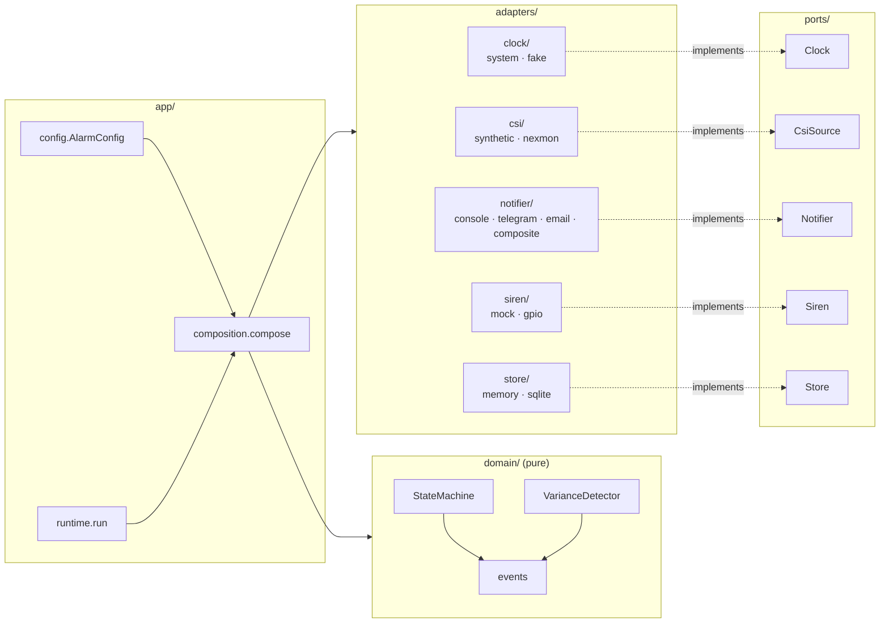
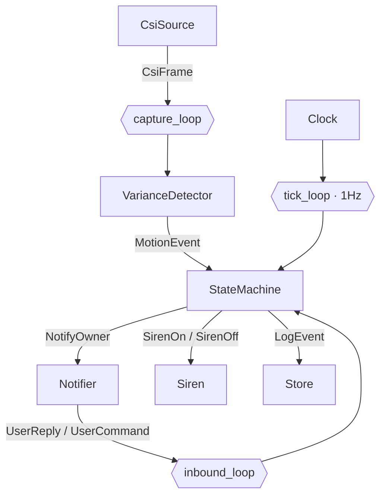
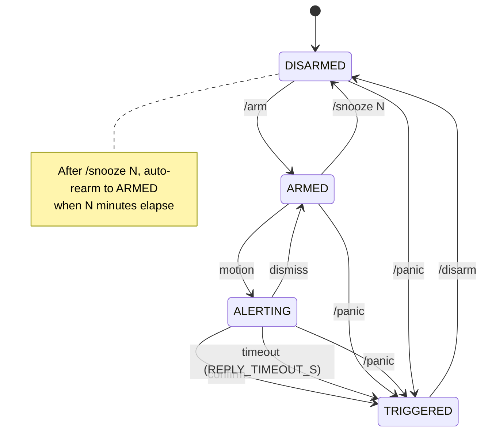

# Architecture

## Hexagonal layout

The domain core depends on nothing. Adapters depend on the ports they
implement. The composition root in `app/` is the only place that knows
about concrete adapter classes.

## Runtime: three concurrent loops

## State machine

